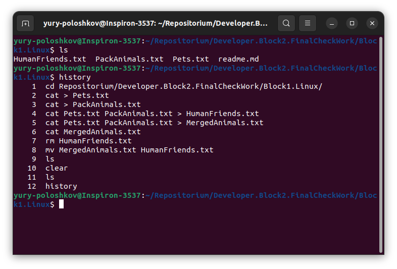
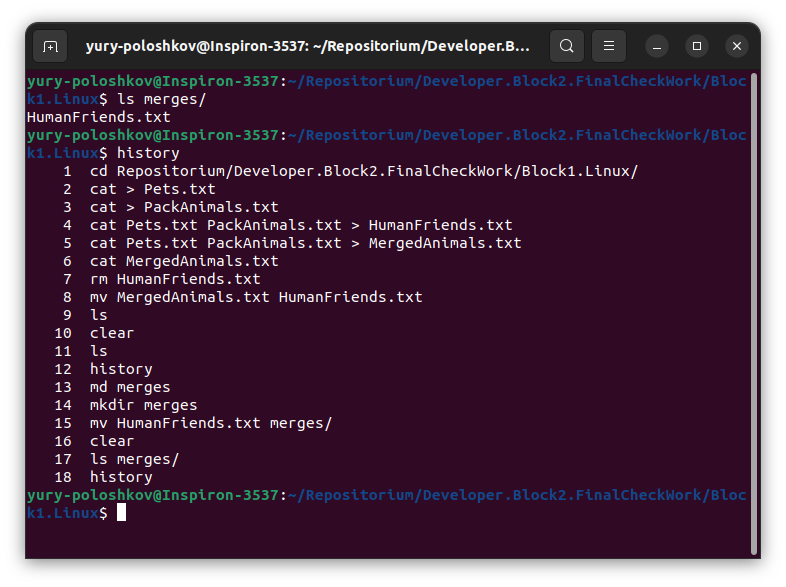
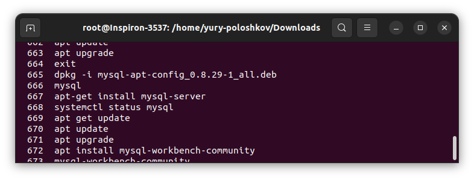
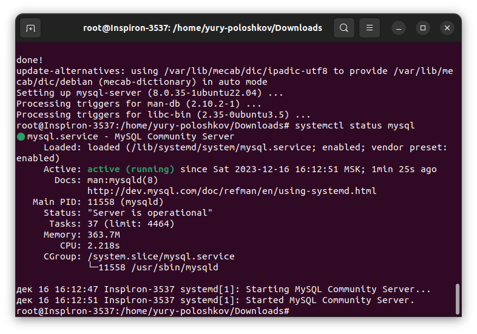
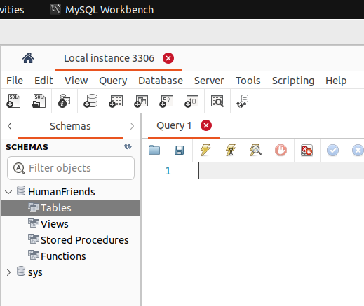

# Блок 1. Операционные системы и виртуализация (Linux)

## Задачи

1. Использование команды cat в Linux
   - Создать два текстовых файла: "Pets"(Домашние животные) и "Pack animals"(вьючные животные), используя команду `cat` в терминале Linux. В первом файле перечислить собак, кошек и хомяков. Во втором — лошадей, верблюдов и ослов.
   - Объединить содержимое этих двух файлов в один и просмотреть его содержимое.
   - Переименовать получившийся файл в "Human Friends".

### Решение задачи 1

2. Работа с директориями в Linux
   - Создать новую директорию и переместить туда файл "Human Friends".

### Решение задачи 2

3. Работа с MySQL в Linux. “Установить MySQL на вашу вычислительную машину ”
   - Подключить дополнительный репозиторий MySQL и установить один из пакетов из этого репозитория.

### Решение задачи 3

4. Управление deb-пакетами
   - Установить и затем удалить deb-пакет, используя команду `dpkg`.

5. История команд в терминале Ubuntu
   - Сохранить и выложить историю ваших терминальных команд в Ubuntu.
В формате: Файла с ФИО, датой сдачи, номером группы(или потока).

### Решение задачи 3-5

